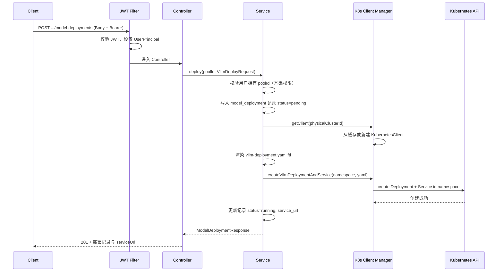

# 请求处理与 K8s 交互流程

## 1. 整体流程（从前端到 K8s）

## 2. 训练任务提交流程（VolcanoJob）

1. 客户端携带 JWT 调用 `POST /api/v1/resource-pools/{poolId}/training-jobs`。
2. JWT Filter 解析 token，将 UserPrincipal（含 role、resourcePoolIds）放入 SecurityContext。
3. Controller 调用 `TrainingJobService.submit(poolId, request)`。
4. Service 校验 `user.canAccessPool(poolId)`，加载 ResourcePool，渲染 `volcano-job.yaml.ftl`，调用 `KubernetesClientManager.applyYamlInNamespace` 在对应 namespace 下创建 VolcanoJob。
5. 返回 201 与 jobName。

## 3. 示例报文（vLLM 部署）

- **请求**：见 [EXAMPLE-REQUEST.md](EXAMPLE-REQUEST.md) 第 5 节。
- **响应**：返回部署记录 id、status、serviceUrl 等；后续可通过 `GET .../model-deployments/{id}` 查询状态（含 K8s readyReplicas）。
